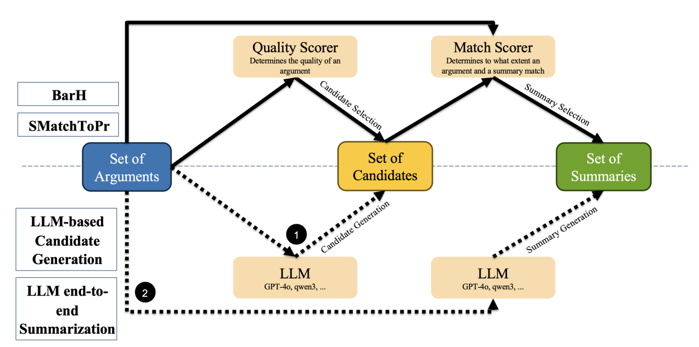

# Argument Summarization and its Evaluation in the Era of Large Language Models

This repository contains the code and data for our EMNLP 2025 paper: [Argument Summarization and its Evaluation in the Era of Large Language Models](https://aclanthology.org/2025.emnlp-main.1797/).


[](https://arxiv.org/abs/2503.00847)


<div align="center">

</div>

> **Abstract**: 
> Large Language Models (LLMs) have revolutionized various Natural Language Generation (NLG) tasks, including Argument Summarization (ArgSum), a key subfield of Argument Mining. This paper investigates the integration of state-of-the-art LLMs into ArgSum systems and their evaluation. In particular, we propose a novel prompt-based evaluation scheme, and validate it through a novel human benchmark dataset. Our work makes three main contributions: (i) the integration of LLMs into existing ArgSum systems, (ii) the development of two new LLM-based ArgSum systems, benchmarked against prior methods, and (iii) the introduction of an advanced LLM-based evaluation scheme. We demonstrate that the use of LLMs substantially improves both the generation and evaluation of argument summaries, achieving state-of-the-art results and advancing the field of ArgSum. We also show that among the four LLMs integrated in (i) and (ii), Qwen-3-32B, despite having the fewest parameters, performs best, even surpassing GPT-4o.


## 🎬 Preparations: 

1. Replace the *models* folder with the following folder from Google Drive: https://drive.google.com/drive/folders/1GUzNhU6DK3KRUV-f4cX2xEb8ifTJKhm6
2. Insert your username and password of the Summetix API service into *argsum/___summetix_login.json*

## 🍽 Structure: 

- *data* folder: Datasets
- *models* folder: Language models (LMs) (divided into Match Scorers, Quality Scorers, Metics, and ArgSum Generators)
- *argsum* folder: Python code for functions and classes used in the investigations (+ the code for BLEURT and a json including the login information for the Summetix API service)
- *investigations* folder: Data resulting from the investigations
- Jupyter notebooks: Conducted investigations and results

## 🏄‍♀️ Investigations (.ipynb):

1. *data_processing*: Preparation of the raw data for the investigations
2. *explorative_data_analysis*: Exploratory data analysis
3. *quality_scorer*: Fine-tuning of LMs for argument quality scoring (+ their evaluation)
4. *match_scorer*: Fine-tuning of LMs for determining a match score between an argument and argument summary (+ their evaluation)
5. *flan_t5_sum*: Fine-tuning of FLAN T5 for argument summary generation (given a cluster of similar arguments)
6. *human_eval*: Examination of inter-rater reliability and the correlation between human judgements and automatic evaluation metrics
7. *arg_seperation_capability*: Examination of the ability of clustering-based ArgSum systems to separate arguments 
8. *get_cluster_sums*: Generation of argument summaries with clustering-based ArgSum systems
9. *get_classification_sums*: Generation of argument summaries with classification-based ArgSum systems
10. *eval_sums*: Automatic evaluation of the generated argument summaries

## 🧘 Citation

If you use the code or data from this work, please include the following citation:

```
@inproceedings{altemeyer-etal-2025-argument,
    title = "Argument Summarization and its Evaluation in the Era of Large Language Models",
    author = "Altemeyer, Moritz  and
      Eger, Steffen  and
      Daxenberger, Johannes  and
      Chen, Yanran  and
      Altendorf, Tim  and
      Cimiano, Philipp  and
      Schiller, Benjamin",
    editor = "Christodoulopoulos, Christos  and
      Chakraborty, Tanmoy  and
      Rose, Carolyn  and
      Peng, Violet",
    booktitle = "Proceedings of the 2025 Conference on Empirical Methods in Natural Language Processing",
    month = nov,
    year = "2025",
    address = "Suzhou, China",
    publisher = "Association for Computational Linguistics",
    url = "https://aclanthology.org/2025.emnlp-main.1797/",
    doi = "10.18653/v1/2025.emnlp-main.1797",
    pages = "35490--35511",
    ISBN = "979-8-89176-332-6"
}
```